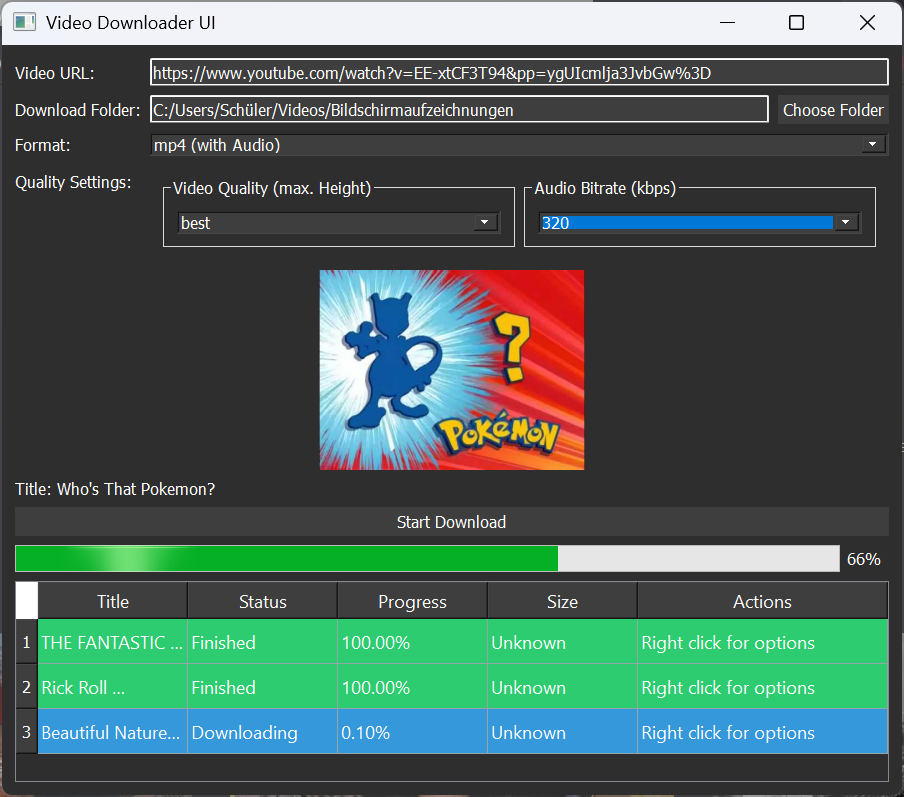

[](https://github.com/truelockmc/video-downloader/issues)
[](https://github.com/truelockmc/video-downloader/issues?q=is%3Aissue+is%3Aclosed)<br>

# Python Video Downloader by true_lock

A PyQt5-based UI video downloader that leverages [yt-dlp](https://github.com/yt-dlp/yt-dlp) for video extraction and downloading. The application provides an easy to use graphical user interface with usefull Costumization Settings.
This Tool supports every Site yt-dlp supports + [additional ones](https://github.com/truelockmc/video-downloader/blob/main/README.md#additonally-supported-sites)



## Features

- 📥 **Video Downloading:** You can Download Videos and Audio from most Websites.  
- 🏷️ **Video Metadata Extraction:** Automatically retrieves video title, thumbnail, and file size.  
- 🎞️ **Download Options:** Choose from multiple formats including mp4 (with/without audio), mp3, avi, and mkv.  
- 🎚️ **Quality Settings:** Customize video quality and audio bitrate.  
- 📊 **Progress Tracking:** Monitor individual download progress as well as overall progress.  
- 🔗 **Multi Threading:** Download as much at the same time as you want.  
- ⏸️▶️✖️ **Download Control:** Pause, cancel and resume downloads.  
- ⚡ **Faster Download Speed:** Automatically adjusts download settings based on your network connection.
- 🌙 **Dark Mode UI:** A modern, dark-themed interface built with PyQt5.

## Prerequisites

- Python 3.6 or higher. _(only if using the raw source code instead of an Release Binary)_
- [ffmpeg](https://ffmpeg.org/) is required for merging files. The application checks for ffmpeg and offers to install it via `winget` if it's not found.

## Installation

### Using an compiled Binary from Releases:
1. **Download the zip file for your operating system from the [Latest Release](https://github.com/truelockmc/video-downloader/releases/latest)**

2. **Unpack it**

### Using the Python Code 
1. **Clone the repository:**
   ```bash
   git clone https://github.com/truelockmc/video-downloader.git
   cd video-downloader
   ```

2. **Install the required packages:**
   ```bash
   pip install -r requirements.txt
   ```

## Usage

Run the main Python script:
```bash
python main.py
```
_(or just run the Executable you got from releases)_

Upon launching, the UI will allow you to input a video URL, choose a download folder, select a file format, and configure quality settings. The downloader will then extract metadata, display a preview, and manage the download process.

## Additonally supported Sites:
- [Videasy](https://www.videasy.net/player), a known 🏴‍☠️ video Provider Site. (You cannot directly input the player link, you need to get the .m3u8 Link) [Here's how](https://github.com/truelockmc/video-downloader/blob/main/Docs/videasy.md). This also works for similiar Websites.


## Help

If you have any questions or Encounter Problems feel free to contact me per E-mail (anonyson@proton.me) or [Discord](https://discord.com/invite/wDESTYeZy9).
You can also create an Github [Issue](https://github.com/truelockmc/video-downloader/issues/new).

## Contributing

Contributions are welcome! Please open an issue or submit a pull request for any improvements or bug fixes.

## Made by [me](https://github.com/truelockmc) : )
