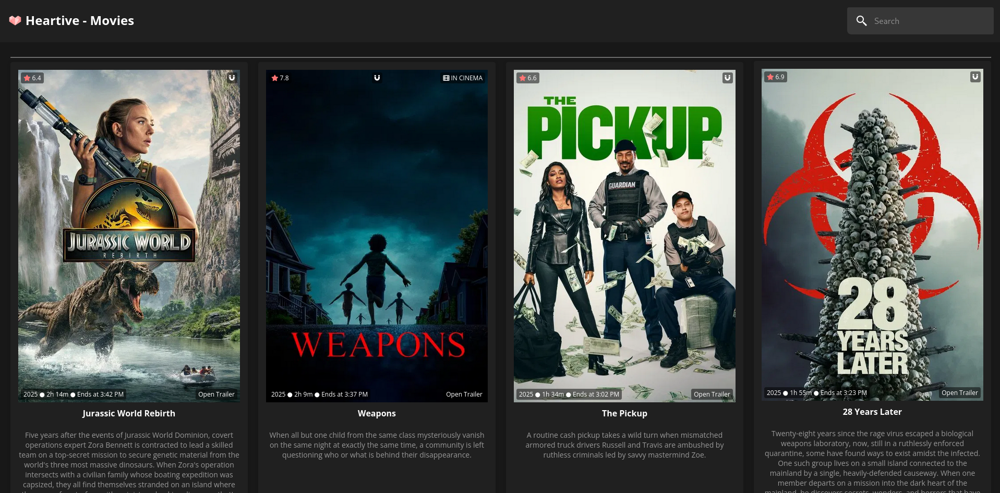
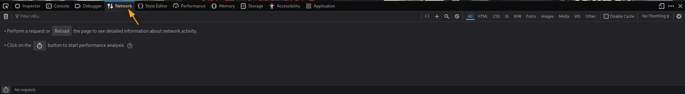
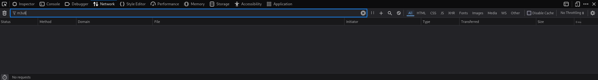
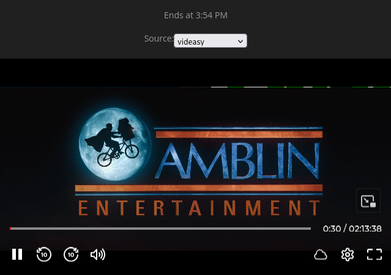
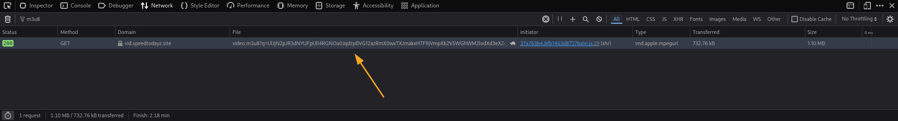
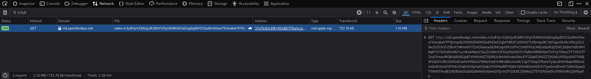

# How to download from videasy

You cannot directly input a player link like https://player.videasy.net/movie/1234821, as this doesnt directly lead to the video file.  
So, you need to get the Link to the .m3u8 file.

## How to

1. Open the Site with the Movie you would like to download
   
2. Open the Developer Tools using Control+Shift+I or Right Clicking and selecting Inspect.
   
3. Navigate to the Network Tab.
   
4. Search for m3u8
   
5. Play the Movie you would like to download.
    
6. Wait until something shows up in the network tab, then Pause the Movie.
    
7. Click on that Request and Copy The URL Value.
    

### Finished, you can now input that link into the Video Downloader
